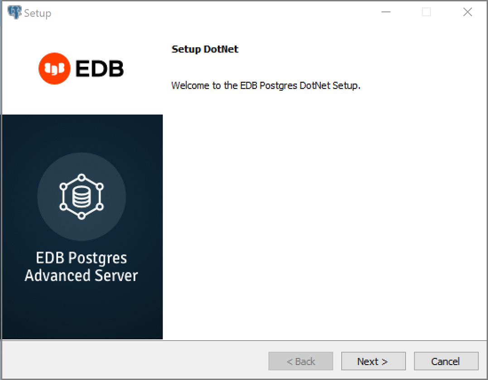
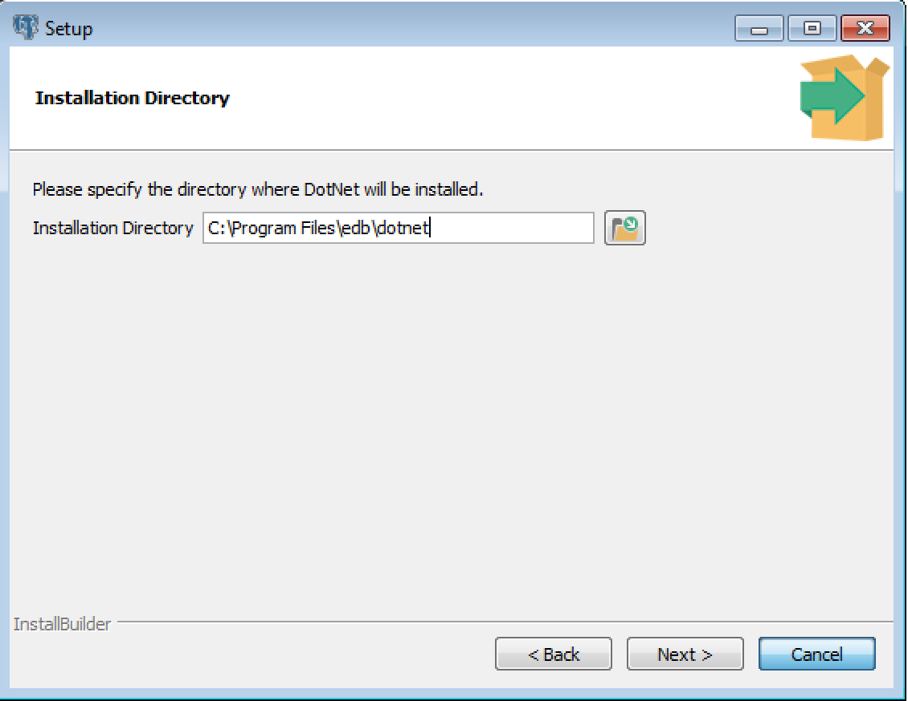
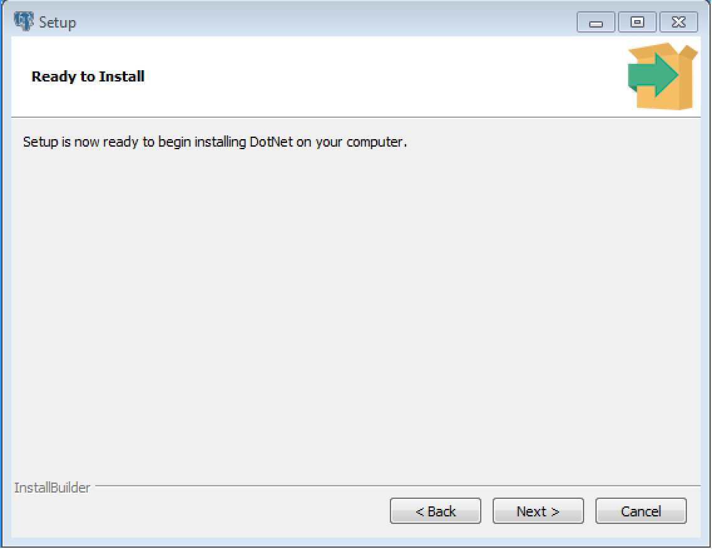
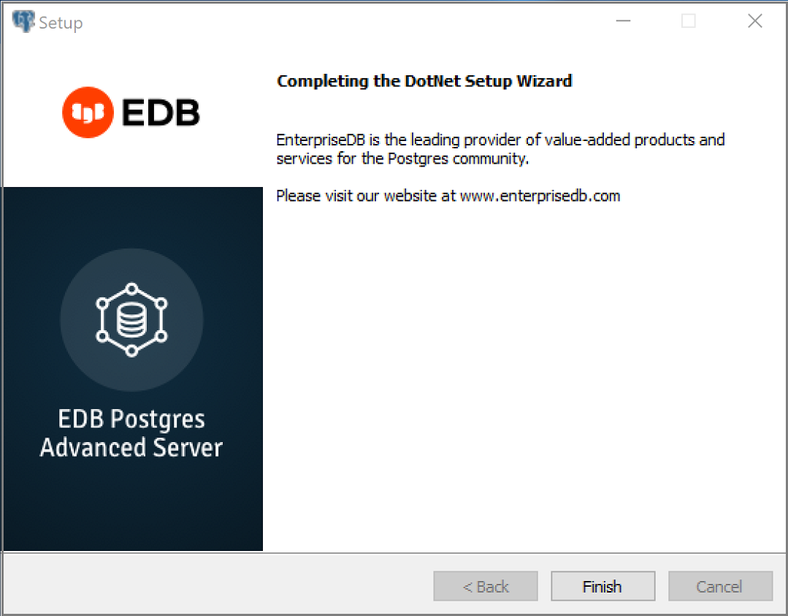
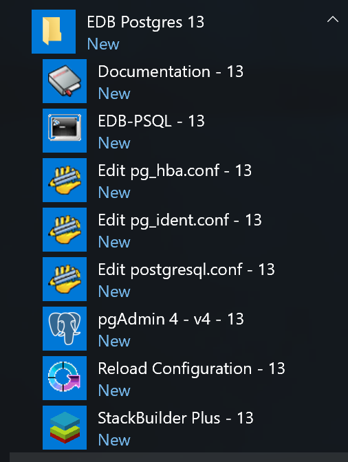
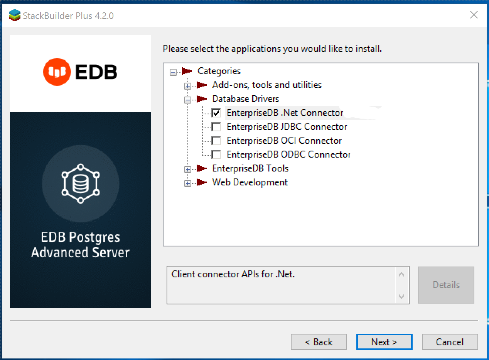

.. _installing_and_configuring_the_net_connector:

******************************************************
`Installing and Configuring the .NET Connector`:index:
******************************************************

This chapter describes how to install and configure the EDB
.NET Connector.

Installing the .NET Connector
=============================

You can use the EDB .NET Connector Installer (available
`from the EDB website <https://www.enterprisedb.com/software-downloads-postgres>`_) to add the
.NET Connector to your system.  After downloading the installer, right-click on the installer icon, and
select ``Run As Administrator`` from the context menu.  When prompted,
select an installation language and click ``OK`` to continue to the ``Setup`` window.

   *The .NET Connector Installation wizard*

Click ``Next`` to continue.

   *The Installation dialog*

Use the ``Installation Directory`` dialog to specify the
directory in which the connector will be installed, and click ``Next`` to
continue.

   *The Ready to Install dialog*

Click ``Next`` on the ``Ready to Install`` dialog to start the
installation; popup dialogs confirm the progress of the installation
wizard.

   *The installation is complete*

When the wizard informs you that it has completed the setup, click the
``Finish`` button to exit the dialog.

.. raw:: latex

    \newpage

You can also use StackBuilder Plus to add or update the connector on an
existing Advanced Server installation; to open StackBuilder Plus, select
``StackBuilder Plus`` from the Windows ``Apps`` menu.

   *Starting StackBuilder Plus*

.. raw:: latex

    \newpage

When StackBuilder Plus opens, follow the onscreen instructions.

Select the ``EnterpriseDB.Net Connector`` option from the ``Database Drivers`` node of the tree control.

   *Selecting the Connectors installer*

Follow the directions of the onscreen wizard to add or update an
installation of an EDB Connector.

.. raw:: latex

    \newpage

Configuring the .NET Connector
==============================

.. index:: configuring the .NET connector

Please see the following environment-specific sections for information about configuring the .NET Connector:

-  **Referencing the Library Files.** :ref:`General configuration information <referencing_the_library_files>`
   applicable to all components.

-  **.NET Framework 4.0.** Instructions for configuring for use with
   :ref:`.NET Framework 4.0 <framework_setup_4>`.

-  **.NET Framework 4.5.** Instructions for configuring for use with
   :ref:`.NET Framework 4.5 <framework_setup_4_5>`.

-  **.NET Framework 4.5.1.** Instructions for configuring for use with
   :ref:`.NET Framework 4.5.1 <framework_setup_4_5_1>`.

-  **.NET Framework 4.6.1** Instructions for configuring for use with :ref:`.NET Framework 4.6.1 <framework_setup_4_6_1>`.

-  **.NET Standard 2.0.** Instructions for configuring for use with
   :ref:`.NET Standard 2.0 <standard_setup_2>`.

-  **.NET Standard 2.1.** Instructions for configuring for use with :ref:`.NET Standard 2.1 <standard_setup_2.1>`.

-  **.NET Core 3.0** Instructions for configuring for use with :ref:`.NET Core 3.0 <framework_setup_core3.0>`.

-  **Entity Framework 5/6.** Instructions for configuring for use with
   :ref:`Entity Framework <entity_setup_5_6>`.

-  **EDB VSIX.** Instructions for configuring for use with
   :ref:`EDB VSIX <vsix_setup>`.

.. raw:: latex

    \newpage

Referencing the Library Files
-----------------------------
.. _referencing_the_library_files:
.. index:: referencing the library files

To reference library files with Microsoft Visual Studio:

1. Select the project in the ``Solution Explorer``.

2. Select ``Add Reference`` from the ``Project`` menu.

3. When the ``Add Reference`` dialog box opens, browse to select the
   appropriate library files.

Optionally, the library files can be copied to the specified location.

Before you can use an EDB .NET class, you must import the
namespace into your program. Importing a namespace makes the compiler
aware of the classes available within the namespace. The namespace is:

   ``EnterpriseDB.EDBClient``

If you are using Entity Framework 6, the following additional namespace is required:

   ``EntityFramework6.EntepriseDB.EDBClient``

The method you use to include the namespace varies by the type of
application you are writing. For example, the following command imports
a namespace into an ``ASP.NET`` page:

   ``<% import namespace="EnterpriseDB.EDBClient" %>``

To import a namespace into a C# application, write:

   ``using EnterpriseDB.EDBClient;``

.. raw:: latex

    \newpage

.NET Framework Setup
--------------------

.. index:: .NET framework setup

The following sections describe the setup for various .NET versions.

.. _framework_setup_4:

.NET Framework 4.0
~~~~~~~~~~~~~~~~~~

If you are using .NET Framework version 4.0, the data provider
installation path is:

   ``C:\Program Files\edb\dotnet\net40\``

You must add the following dependencies to your project:

   ``EDBDataProvider.2.0.2.dll``

   ``Mono.Security.dll``

Depending upon the type of application you use, you may be required to import the namespace into the source code.  See :ref:`Referencing the Library Files <referencing_the_library_files>` for this and other information about referencing library files.

.. _framework_setup_4_5:

.. raw:: latex

    \newpage

.NET Framework 4.5
~~~~~~~~~~~~~~~~~~

If you are using .NET Framework version 4.5, the data provider
installation path is:

   ``C:\Program Files\edb\dotnet\net45\``

You must add the following dependencies to your project:

   ``EnterpriseDB.EDBClient.dll``

   ``System.Threading.Tasks.Extensions.dll``

   ``System.Runtime.CompilerServices.Unsafe.dll``

   ``System.ValueTuple.dll``

   ``System.Memory.dll``

Depending upon the type of application you use, you may be required to import the namespace into the source code.  See :ref:`Referencing the Library Files <referencing_the_library_files>` for this and other information about referencing library files.

.. _framework_setup_4_5_1:

.. raw:: latex

    \newpage

.NET Framework 4.5.1
~~~~~~~~~~~~~~~~~~~~

If you are using .NET Framework version 4.5.1, the data provider
installation path is:

   ``C:\Program Files\edb\dotnet\net451\``

You must add the following dependencies to your project:

   ``EnterpriseDB.EDBClient.dll``

   ``System.Threading.Tasks.Extensions.dll``

   ``System.Runtime.CompilerServices.Unsafe.dll``

   ``System.ValueTuple.dll``

   ``System.Memory.dll``

Depending upon the type of application you use, you may be required to import the namespace into the source code.  See :ref:`Referencing the Library Files <referencing_the_library_files>` for this and other information about referencing library files.

.. _framework_setup_4_6_1:

.. raw:: latex

    \newpage

.NET Framework 4.6.1
~~~~~~~~~~~~~~~~~~~~

If you are using .NET Framework version 4.6.1, the data provider
installation path is:

   ``C:\Program Files\edb\dotnet\net461\``

You must add the following dependencies to your project:

   ``EnterpriseDB.EDBClient.dll``

   ``Microsoft.Bcl.AsyncInterfaces.dll``

   ``System.Memory.dll``

   ``System.Numerics.Vectors.dll``

   ``System.Runtime.CompilerServices.Unsafe.dll``

   ``System.Runtime.dll``

   ``System.Text.Json.dll``

   ``System.Threading.Tasks.Extensions.dll``

   ``System.ValueTuple.dll``

Depending upon the type of application you use, you may be required to import the namespace into the source code.  See :ref:`Referencing the Library Files <referencing_the_library_files>` for this and other information about referencing library files.

.. _standard_setup_2:

.. raw:: latex

    \newpage

.NET Standard 2.0
~~~~~~~~~~~~~~~~~

For .NET Standard Framework 2.0, the data provider installation path is:

   ``C:\Program Files\edb\dotnet\netstandard2.0\``

You must add the following dependencies to your project:

   ``EnterpriseDB.EDBClient.dll``

   ``System.Threading.Tasks.Extensions.dll``

   ``System.Runtime.CompilerServices.Unsafe.dll``

   ``System.ValueTuple.dll``

.. note:: If your target framework is .Net Core 2.0, then include the
 following file in your project:

   ``System.Threading.Tasks.Extensions.dll``

Depending upon the type of application you use, you may be required to import the namespace into the source code.  See :ref:`Referencing the Library Files <referencing_the_library_files>` for this and other information about referencing library files.

.. _standard_setup_2.1:

.. raw:: latex

    \newpage

.NET Standard 2.1
~~~~~~~~~~~~~~~~~

For .NET Standard Framework 2.1, the data provider installation path is:

   ``C:\Program Files\edb\dotnet\netstandard2.1\``

The following shared library files are required:

   ``EnterpriseDB.EDBClient.dll``

   ``System.Memory.dll``

   ``System.Runtime.CompilerServices.Unsafe.dll``

   ``System.Text.Json.dll``

   ``System.Threading.Tasks.Extensions.dll``

   ``System.ValueTuple.dll``

Depending upon the type of application you use, you may be required to import the namespace into the source code.  See :ref:`Referencing the Library Files <referencing_the_library_files>` for this and other information about referencing library files.

.. _framework_setup_core3.0:

.. raw:: latex

    \newpage

.NET Core 3.0
~~~~~~~~~~~~~

If you are using .NET Core 3.0, the data provider
installation path is:

   ``C:\Program Files\edb\dotnet\netcoreapp3.0\``

The following shared library files are required:

   ``EnterpriseDB.EDBClient.dll``

   ``System.Threading.Tasks.Extensions.dll``

   ``System.Runtime.CompilerServices.Unsafe.dll``

   ``System.ValueTuple.dll``

   ``System.Memory.dll``

Depending upon the type of application you use, you may be required to import the namespace into the source code.  See :ref:`Referencing the Library Files <referencing_the_library_files>` for this and other information about referencing library files.

.. _entity_setup_5_6:

.. raw:: latex

    \newpage

Entity Framework 5/6
--------------------

To configure the .NET Connector for use with Entity Framework, the data
provider installation path is:

**For net45**

   ``C:\Program Files\edb\dotnet\EF\net45``

The following shared library files are required:

   ``EntityFramework5.EnterpriseDB.EDBClient.dll``

   ``EntityFramework6.EnterpriseDB.EDBClient.dll``

**For net461**

  ``C:\Program Files\edb\dotnet\EF\net461``

The following shared library files are required:

  ``EntityFramework6.EnterpriseDB.EDBClient.dll``

.. note:: Entity Framework can be used with the ``EnterpriseDB.EDBClient.dll`` library available in the ``net45``, ``net451`` and ``net461`` subdirectories.

See :ref:`Referencing the Library Files <referencing_the_library_files>` for information about referencing library files.

Add the ``<DbProviderFactories>`` entries for the ``ADO.NET`` driver for
Postgres to the ``app.config`` file. Add the following entries:

.. code-block:: text

  <add name="EnterpriseDB.EDBClient"
    invariant="EnterpriseDB.EDBClient"
    description=".NET Data Provider for EnterpriseDB PostgreSQL”
    type="EnterpriseDB.EDBClient.EDBFactory, EnterpriseDB.EDBClient, Version=4.1.3.1, Culture=neutral, PublicKeyToken=5d8b90d52f46fda7"
    support="FF"/>

In the project’s ``app.config`` file add the following entry for provider
services under the EntityFramework/providers tag:

.. code-block:: text

  <provider invariantName="EnterpriseDB.EDBClient"
    type="EnterpriseDB.EDBClient.EDBServices, EntityFramework6.EnterpriseDB.EDBClient">
  </provider>

The following is an example of the ``app.config`` file:

.. code-block:: text

  <?xml version="1.0" encoding="utf-8" ?>
  <configuration>
    <configSections>
      <section name="entityFramework" type="System.Data.Entity.Internal.ConfigFile.EntityFrameworkSection, EntityFramework, Version=6.0.0.0, Culture=neutral, PublicKeyToken=b77a5c561934e089" requirePermission="false"/>
    </configSections>

      <startup>
          <supportedRuntime version="v4.0" sku=".NETFramework,Version=v4.5" />
      </startup>

   <entityFramework>
     <providers>
       <provider invariantName="EnterpriseDB.EDBClient" type="EnterpriseDB.EDBClient.EDBServices, EntityFramework6.EnterpriseDB.EDBClient"></provider>
     </providers>
   </entityFramework>

   <system.data>
     <DbProviderFactories>
       <remove invariant="EnterpriseDB.EDBClient"/>
       <add name="EnterpriseDB Data Provider" invariant="EnterpriseDB.EDBClient" support="FF" description=".Net Framework Data Provider for Postgresql" type="EnterpriseDB.EDBClient.EDBFactory, EnterpriseDB.EDBClient"/>
     </DbProviderFactories>
   </system.data>

  </configuration>

.. note:: The same entries for ``<providers>`` and ``<DbProviderFactories>`` are valid for the ``web.config`` file and the ``app.config`` file.

Depending upon the type of application you are using, you may be required to import the namespace into the
source code (see :ref:`Referencing the Library Files <referencing_the_library_files>`).

For usage information about Entity Framework, refer to the Microsoft documentation.

.. _vsix_setup:

.. raw:: latex

    \newpage

EDB VSIX for Visual Studio 2015/2017/2019
-----------------------------------------

The EDB Data Designer Extensibility Provider (EDB VSIX) is a
component that integrates Advanced Server database access into Visual
Studio, thus providing Visual Studio integrated features.

EDB VSIX allows you to connect to Advanced Server from within Visual Studio's
Server Explorer and create a model from an existing database.
Therefore, if Visual Studio features are desired, then EDB VSIX
must be utilized.

EDB VSIX files are located in the following directory:

**For net45**

   ``C:\Program Files\edb\dotnet\vsix\net45``

The files available at the above location are:

   | ``EnterpriseDB.vsix``
   | ``SSDLToPgSQL.tt``
   | ``System.ValueTuple.dll``

**For net461**

  ``C:\Program Files\edb\dotnet\vsix\net461``

The files available at the above location are:

  | ``EnterpriseDB.vsix``
  | ``SSDLToPgSQL.tt``
  | ``System.ValueTuple.dll``

Installation and Configuration for Visual Studio 2015/2017/2019
~~~~~~~~~~~~~~~~~~~~~~~~~~~~~~~~~~~~~~~~~~~~~~~~~~~~~~~~~~~~~~~

Use the following steps to install and configure EDB VSIX.

**Step 1:** Install EDB VSIX to the desired version of Visual
Studio with the ``EnterpriseDB.vsix`` installer.

If you already have an earlier version of the VSIX installed, we
highly recommended that you uninstall it to avoid conflicts.

It is no longer necessary or recommended to have ``EnterpriseDB.EDBClient``
in your global assembly cache (GAC).

**Step 2:** Relaunch Visual Studio and verify from the ``Tools > Extensions
and Updates…`` menu that the EDB extension is installed.

**Step 3:** Use the ``gacutil`` utility at the Visual Studio Developers
Command Line to add following libraries to the global assembly cache (GAC):

| ``System.ValueTuple.dll``
| ``System.Threading.Tasks.Extensions.dll``
| ``System.Runtime.CompilerServices.Unsafe.dll``
| ``System.Memory.dll``

For example:

  ``> gacutil.exe /i System.ValueTuple.dll``

.. note::

  Other than the assemblies mentioned above, the following two additional assemblies are required for net461:

  | ``Microsoft.Bcl.AsyncInterfaces.dll``
  | ``System.Text.Json.dll``

**Step 4:** From the Server Explorer, right-click on ``Data Connections``, click
``Add Connection``, and verify that the ``Enterprisedb Postgres Database`` data
source is available.

.. raw:: latex

    \newpage

Model First and Database First Usage
~~~~~~~~~~~~~~~~~~~~~~~~~~~~~~~~~~~~

**Step 1:** Use the ``gacutil`` utility at the Visual Studio Developers
Command Line to add the ``EntityFramework5.EnterpriseDB.EDBClient.dll`` library
to the global assembly cache (GAC):

For example:

  ``> gacutil.exe /i EntityFramework5.EnterpriseDB.EDBClient.dll``

**Step 2:** Add the ``<DbProviderFactories>`` entries for the ADO.NET driver
to the ``machine.config`` file. Include the following entries:

.. code-block:: text

  <add name="EnterpriseDB.EDBClient"
    invariant="EnterpriseDB.EDBClient"
    description=".NET Data Provider for EnterpriseDB PostgreSQL"
    type="EnterpriseDB.EDBClient.EDBFactory, EnterpriseDB.EDBClient, Version=4.1.3.1, Culture=neutral, PublicKeyToken=5d8b90d52f46fda7"
    support="FF"/>

For the attribute-value pairs, the double-quoted strings
should not contain excess white space characters, but be configured on a
single line. The examples shown in this section may be split on multiple
lines for clarity, but should actually be configured within a single
line such as the following:

``description=".NET Data Provider for EnterpriseDB PostgreSQL"``

For 64-bit Windows, the ``machine.config`` file is in the following
location:

``C:\Windows\Microsoft.NET\Framework64\v4.0.30319\Config\machine.config``

For 32-bit Windows, the ``machine.config`` file is in the following
location:

``C:\Windows\Microsoft.NET\Framework\v4.0.30319\Config\machine.config``

**Step 3:** Place the DDL generation template ``SSDLToPgSQL.tt`` in the
Visual Studio ``EntityFramework Tools\DBGen\`` folder as shown in the following
example:

.. code-block:: text

  C:\Program Files (x86)\Microsoft Visual Studio 14.0\Common7\IDE\Extensions\Microsoft\EntityFramework Tools\DBGen\

.. note:: Select this template ``SSDLToPgSQL.tt`` in your EDMX file
 properties.

**Step 4:** Add the ``EnterpriseDB.EDBClient.dll`` and ``EntityFramework6.EnterpriseDB.EDBClient.dll`` files to project references. see :ref:`Referencing the Library Files <referencing_the_library_files>` for information about referencing library files.

**Step 5:** Configure your Entity Framework application in either of following two ways:

   - Code-based
   - Config-based.

**Code-based**

Define a class that inherits from ``DbConfiguration`` in the same assembly as your class inheriting ``DbContext``. Ensure that you configure ``provider services``, a ``provider factory``, and a ``default connection factory`` as shown below:

.. code-block:: text

  using EnterpriseDB.EDBClient;
  using System.Data.Entity;

  class EDBConfiguration : DbConfiguration
  {
  	public EDBConfiguration()
  	{

  		var name = "EnterpriseDB.EDBClient";

  		SetProviderFactory(providerInvariantName: name,
  		providerFactory: EnterpriseDB.EDBClient.EDBFactory.Instance);

  		SetProviderServices(providerInvariantName: name,
  		provider: EnterpriseDB.EDBClient.EDBServices.Instance);

  		SetDefaultConnectionFactory(connectionFactory: new EnterpriseDB.EDBClient.EDBConnectionFactory());
  	}
  }

**Config-based**

In the project’s ``app.config`` file, add the following entry for provider services under the EntityFramework/providers tag:

.. code-block:: text

  <provider invariantName="EnterpriseDB.EDBClient"
    type="EnterpriseDB.EDBClient.EDBServices, EntityFramework6.EnterpriseDB.EDBClient">
  </provider>

The following is an example of the ``app.config`` file.

.. code-block:: text

  <?xml version="1.0" encoding="utf-8" ?>
  <configuration>
    <configSections>
      <section name="entityFramework" type="System.Data.Entity.Internal.ConfigFile.EntityFrameworkSection, EntityFramework, Version=6.0.0.0, Culture=neutral, PublicKeyToken=b77a5c561934e089" requirePermission="false"/>
    </configSections>

      <startup>
          <supportedRuntime version="v4.0" sku=".NETFramework,Version=v4.5" />
      </startup>

    <entityFramework>
      <providers>
        <provider invariantName="EnterpriseDB.EDBClient" type="EnterpriseDB.EDBClient.EDBServices, EntityFramework6.EnterpriseDB.EDBClient"></provider>
      </providers>
    </entityFramework>

    <system.data>
      <DbProviderFactories>
        <remove invariant="EnterpriseDB.EDBClient"/>
        <add name="EnterpriseDB Data Provider" invariant="EnterpriseDB.EDBClient" support="FF" description=".Net Framework Data Provider for EDB Postgres" type="EnterpriseDB.EDBClient.EDBFactory, EnterpriseDB.EDBClient"/>
      </DbProviderFactories>
    </system.data>

  </configuration>
