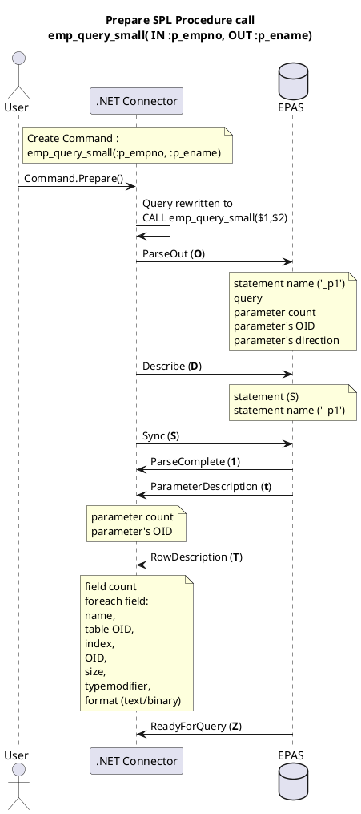
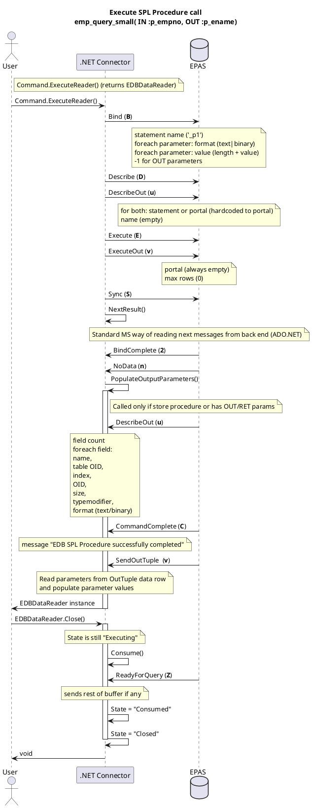

# Front end / Back end protocol Diagrams

## Notes

- For the sake of simplicity, BackEnd to FrontEnd messages are represented as if messages were sent from server. This is not true : server writes to the FE/BE socket, and client consumes it.

- All messages are length prefixed, omitted here for brievity

## Example FE/BE diagrams

Call SPL procedure with an IN param and an OUT param

### Prepare statement

.NET Connector uses EDBCommand to process query and orchestrate EDBConnector for reads & writes on the wire.

### Execute statement

EDBDataReader is instanciated in EDBConnector constructor.

