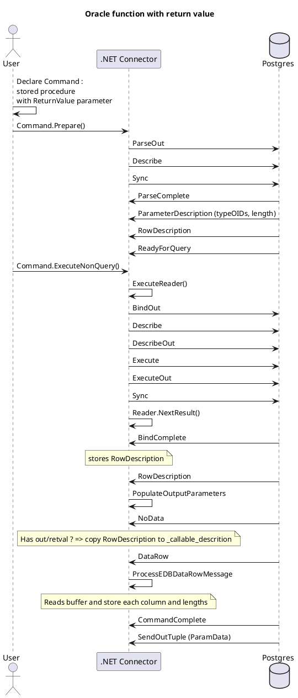

# Front end / Back end protocol Diagrams

Extracted from CountTest regression test (dotnet8)

```plantuml
@startuml

title Oracle function with return value
actor User as U
participant ".NET Connector" as C
database Postgres as S

U -> U : Declare Command :\nstored procedure\nwith ReturnValue parameter
U -> C : Command.Prepare()
C -> S : ParseOut
C -> S : Describe
C -> S : Sync
S -> C : ParseComplete
S -> C : ParameterDescription (typeOIDs, length)
S -> C : RowDescription
S -> C : ReadyForQuery
U -> C : Command.ExecuteNonQuery()
C -> C : ExecuteReader()
C -> S : BindOut
C -> S : Describe
C -> S : DescribeOut
C -> S : Execute
C -> S : ExecuteOut
C -> S : Sync
C -> C : Reader.NextResult()
S -> C : BindComplete
note over C : stores RowDescription
S -> C : RowDescription
C -> C : PopulateOutputParameters
S -> C : NoData
note over C : Has out/retval ? => copy RowDescription to _callable_descrition
S -> C : DataRow
C -> C : ProcessEDBDataRowMessage
note over C : Reads buffer and store each column and lengths
S -> C : CommandComplete
S -> C : SendOutTuple (ParamData)
@enduml
```
