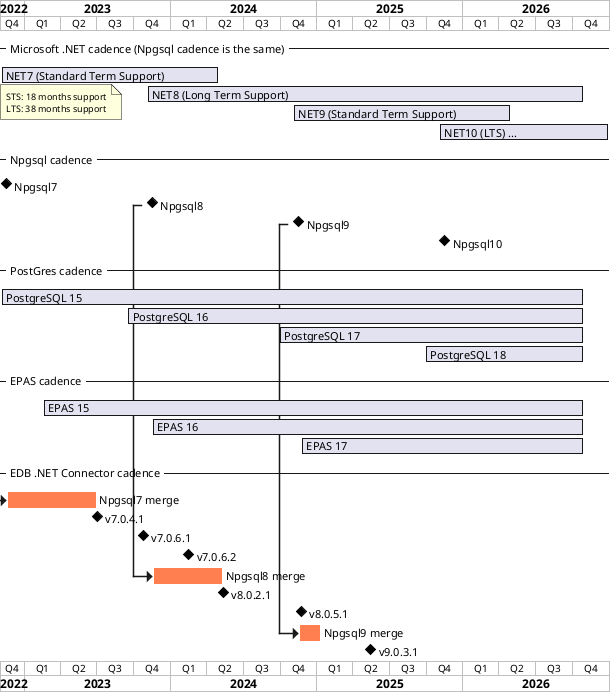

# Release lifecycle

```plantuml
@startgantt
projectscale quarterly
Project starts the 2022-11-01

-- Microsoft .NET cadence (Npgsql cadence is the same) --

[NET7 (Standard Term Support)] as [NET7] starts 2022-11-01 and ends 2024-05-01
note bottom
    STS: 18 months support
    LTS: 38 months support
end note
[NET8 (Long Term Support)] as [NET8] starts 2023-11-01 and ends 2026-11-01
[NET9 (Standard Term Support)] as [NET9] starts 2024-11-01 and ends 2026-05-01
[NET10 (LTS) ...] as [NET10] starts 2025-11-01 and ends 2027-01-01

-- Npgsql cadence --

[Npgsql7] happens 15 days after [NET7]'s start
[Npgsql8] happens 15 days after [NET8]'s start
[Npgsql9] happens 15 days after [NET9]'s start
[Npgsql10] happens 15 days after [NET10]'s start

-- PostGres cadence --

[PostgreSQL 15] starts 2022-10-13 and ends 2026-11-01
[PostgreSQL 16] starts 2023-09-14 and ends 2026-11-01
[PostgreSQL 17] starts 2024-09-26 and ends 2026-11-01
[PostgreSQL 18] starts 2025-09-26 and ends 2026-11-01

-- EPAS cadence --

[EPAS 15] starts 2023-02-14 and ends 2026-11-01
[EPAS 16] starts 2023-11-14 and ends 2026-11-01
[EPAS 17] starts 2024-11-21 and ends 2026-11-01

-- EDB .NET Connector cadence --

[Npgsql7 merge] starts after [Npgsql7]'s start and ends 2023-07-01
[Npgsql7 merge] is colored in Coral
[v7.0.4.1] happens 2023-07-01
[v7.0.6.1] happens 2023-10-25
[v7.0.6.2] happens 2024-02-15
[Npgsql8 merge] starts after [Npgsql8]'s start and ends 2024-05-12
[Npgsql8 merge] is colored in Coral
[v8.0.2.1] happens at [Npgsql8 merge]'s end
[v8.0.5.1] happens 2024-11-22
[Npgsql9 merge] starts after [Npgsql9]'s start and ends 2025-01-12
[Npgsql9 merge] is colored in Coral
[v9.0.3.1] happens 2025-05-15
@endgantt
```

