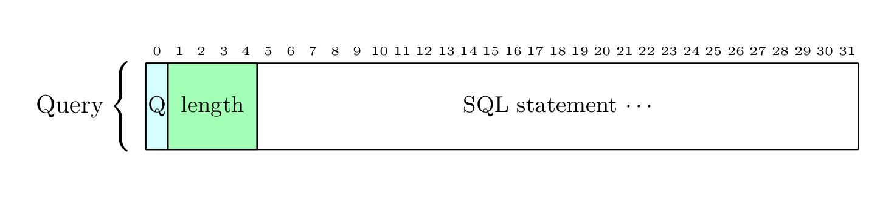

# Simple Query

- Query used in this example : `SELECT * FROM emp WHERE deptno = 20;`
- Result set

    > |empno|ename|job    |mgr |hiredate           |sal    |comm|deptno|
    > |-----|-----|-------|----|-------------------|-------|----|------|
    > |7566 |JONES|MANAGER|7839|1981-04-02 00:00:00|2975.00|    |20    |
    > |7876 |ADAMS|CLERK  |7788|1987-05-23 00:00:00|1100.00|    |20    |
    > |7902 |FORD |ANALYST|7566|1981-12-03 00:00:00|3000.00|    |20    |
    > |7788 |SCOTT|ANALYST|7566|1987-04-19 00:00:00|3000.00|    |20    |
    > |7369 |SMITH|CLERK  |7902|1980-12-17 00:00:00|800.00 |    |20    |

## Messages exchanged on the wire

1. FrontEnd SENDS

    [Query](https://www.postgresql.org/docs/current/protocol-message-formats.html#PROTOCOL-MESSAGE-FORMATS-QUERY)
    

2. BackEnd SENDS

    [RowDescription](https://www.postgresql.org/docs/current/protocol-message-formats.html#PROTOCOL-MESSAGE-FORMATS-ROWDESCRIPTION)
    

    [DataRow](https://www.postgresql.org/docs/current/protocol-message-formats.html#PROTOCOL-MESSAGE-FORMATS-DATAROW)
    

    [CommandComplete](https://www.postgresql.org/docs/current/protocol-message-formats.html#PROTOCOL-MESSAGE-FORMATS-COMMANDCOMPLETE)
    

    [ReadyForQuery](https://www.postgresql.org/docs/current/protocol-message-formats.html#PROTOCOL-MESSAGE-FORMATS-READYFORQUERY)
    
