# SPL Function call with OUT parameters and return value

- Function used in this example :

    ```sql
    CREATE OR REPLACE FUNCTION myFunc(a IN text, b OUT text)
    RETURN int
    AS
    BEGIN
        b := 'I now have a value :)';
        return a;
    END;
    ```

- Parameters

    | Parameter name | a     | b    |  myFunc          |
    |----------------|-------|------|------------------|
    | Direction      | IN    | OUT  |  RETURN VALUE    |
    | Input value    | 10    | -    |  -               |

- Results

    | Parameter name | a     | b                         | mixArgFunc_Test |
    |----------------|-------|---------------------------|-----------------|
    | Direction      | IN    | OUT                       | RETURN VALUE    |
    | Expected value | -     | "I now have a value :)"   | 10              |

## Messages exchanged on the wire

### Prepare

1. FrontEnd SENDS

    ParseOut (EPAS specific)
    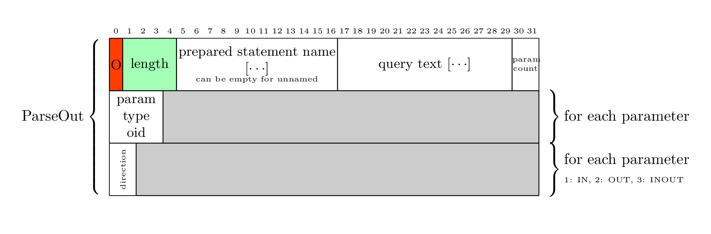

    [Describe](https://www.postgresql.org/docs/current/protocol-message-formats.html#PROTOCOL-MESSAGE-FORMATS-DESCRIBE)
    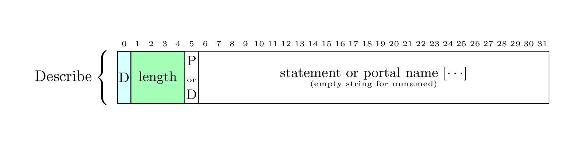

    [Sync](https://www.postgresql.org/docs/current/protocol-message-formats.html#PROTOCOL-MESSAGE-FORMATS-SYNC)
    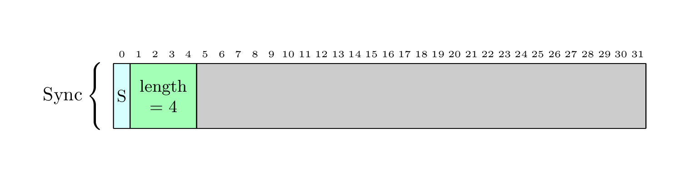

2. BackEnd SENDS

    [ParseComplete](https://www.postgresql.org/docs/current/protocol-message-formats.html#PROTOCOL-MESSAGE-FORMATS-PARSECOMPLETE)
    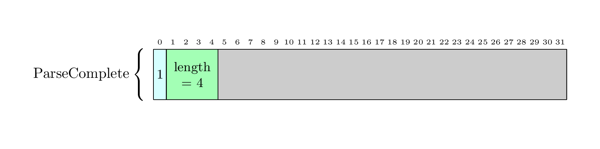

    [ParameterDescription](https://www.postgresql.org/docs/current/protocol-message-formats.html#PROTOCOL-MESSAGE-FORMATS-PARAMETERDESCRIPTION)
    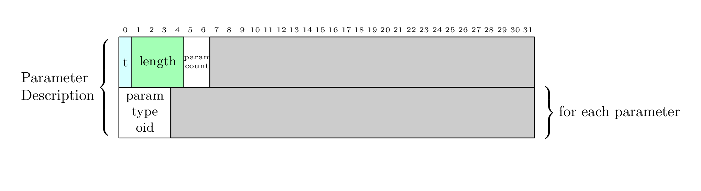

    [RowDescription](https://www.postgresql.org/docs/current/protocol-message-formats.html#PROTOCOL-MESSAGE-FORMATS-ROWDESCRIPTION)

    > There is only one field here : the return value, with name equal to the function name

    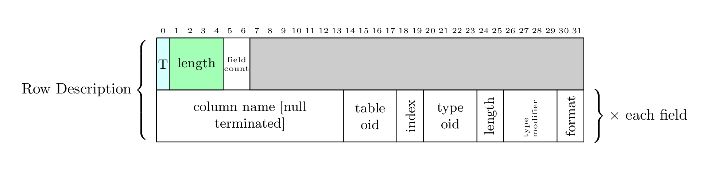

    [ReadyForQuery](https://www.postgresql.org/docs/current/protocol-message-formats.html#PROTOCOL-MESSAGE-FORMATS-READYFORQUERY)
    

### Execute

1. FrontEnd SENDS

    [Bind](https://www.postgresql.org/docs/current/protocol-message-formats.html#PROTOCOL-MESSAGE-FORMATS-BIND)

    > Only one result format as it is the function's return value

    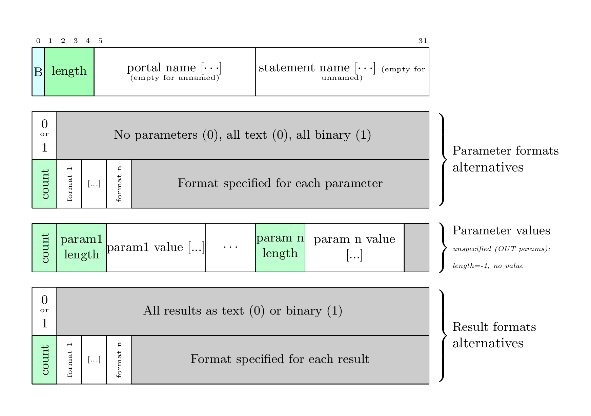

    [Describe](https://www.postgresql.org/docs/current/protocol-message-formats.html#PROTOCOL-MESSAGE-FORMATS-DESCRIBE)
    

    DescribeOut (EPAS SPECIFIC)
    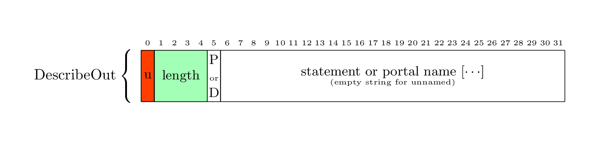

    [Execute](https://www.postgresql.org/docs/current/protocol-message-formats.html#PROTOCOL-MESSAGE-FORMATS-EXECUTE)
    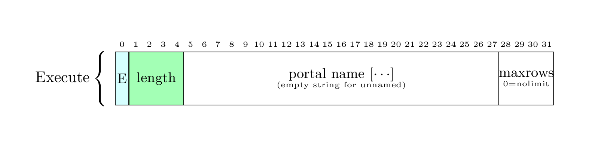

    ExecuteOut (EPAS SPECIFIC)
    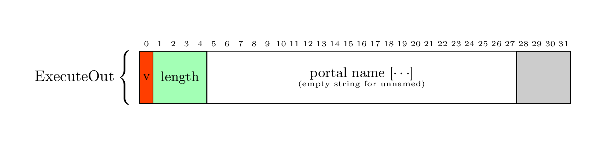

    [Sync](https://www.postgresql.org/docs/current/protocol-message-formats.html#PROTOCOL-MESSAGE-FORMATS-SYNC)
    

2. BackEnd SENDS

    [BindComplete](https://www.postgresql.org/docs/current/protocol-message-formats.html#PROTOCOL-MESSAGE-FORMATS-BINDCOMPLETE)
    

    [RowDescription](https://www.postgresql.org/docs/current/protocol-message-formats.html#PROTOCOL-MESSAGE-FORMATS-ROWDESCRIPTION)
    

    OutDescription (EPAS SPECIFIC)
    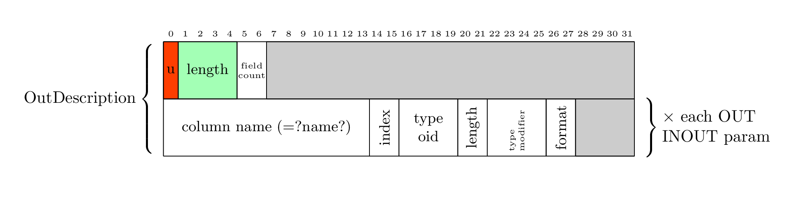

    [DataRow](https://www.postgresql.org/docs/current/protocol-message-formats.html#PROTOCOL-MESSAGE-FORMATS-DATAROW)

    > Only one row for function return value

    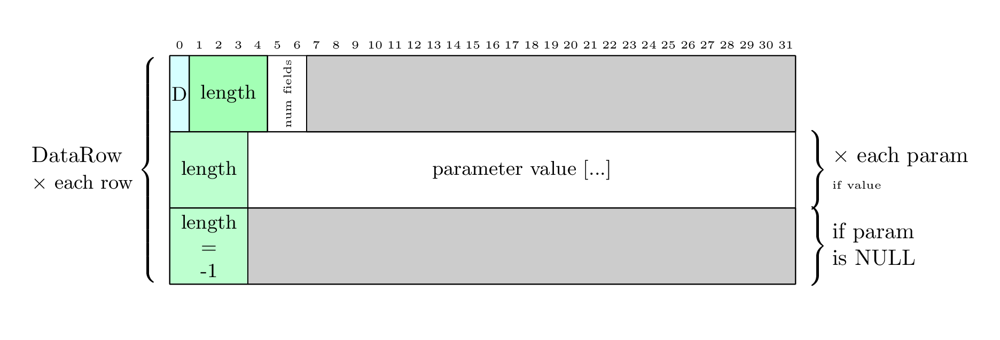

    [CommandComplete](https://www.postgresql.org/docs/current/protocol-message-formats.html#PROTOCOL-MESSAGE-FORMATS-COMMANDCOMPLETE)
    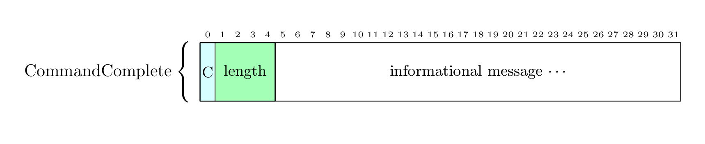

    SendOutTuple (EPAS SPECIFIC)
    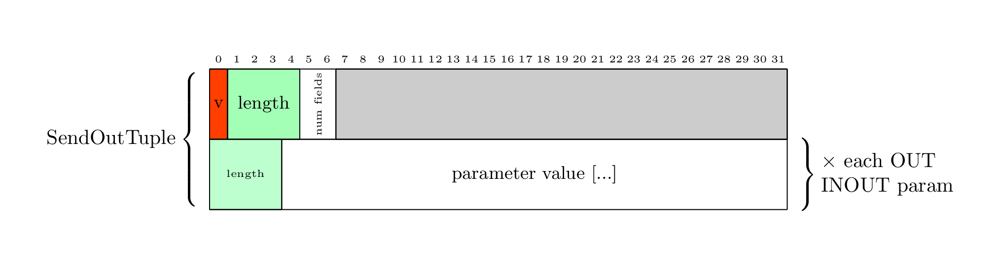

    [RowDescription](https://www.postgresql.org/docs/current/protocol-message-formats.html#PROTOCOL-MESSAGE-FORMATS-ROWDESCRIPTION)

    > I have no explanation on why another row description is returned. Maybe the Front end meesages are wrong ?

    

    [ReadyForQuery](https://www.postgresql.org/docs/current/protocol-message-formats.html#PROTOCOL-MESSAGE-FORMATS-READYFORQUERY)
    

### In the real world

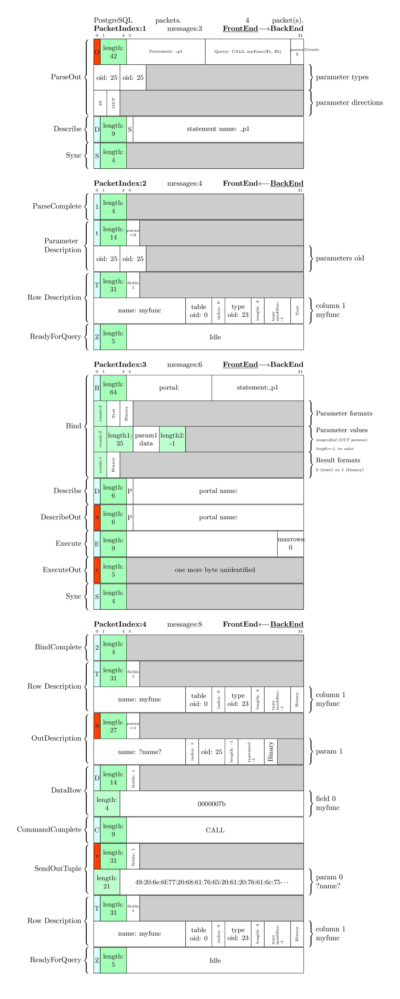
